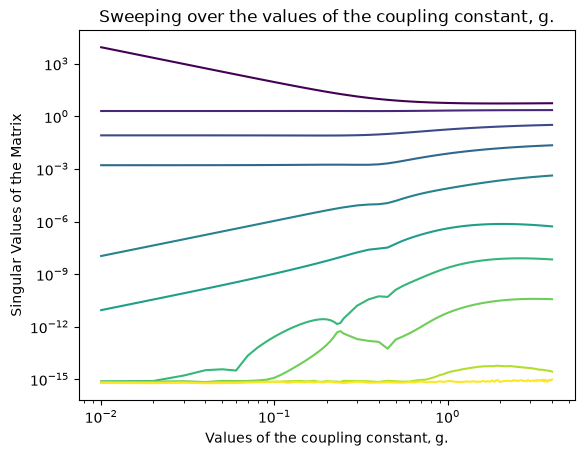
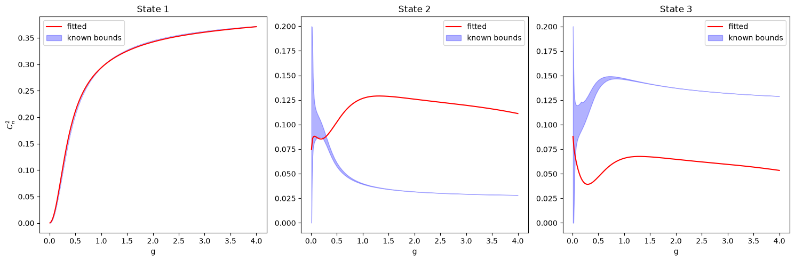

# Wilson-line-CFT

A physics-informed neural network (PINN) approach to the 1D defect CFT
bootstrap for the 1/2-BPS Wilson line in 4d N=4 super Yang-Mills at
strong coupling, benchmarked against the numerical conformal bootstrap
and the reinforcement-learning approach of BootSTOP/MultiSTOP.

**Status:** Completed: special functions, coupling functions, conformal
blocks, integral-constraint module, strong-coupling reference data, convex
baselines, PINN investigation (spectrum given). Not yet attempted: folding
the integral constraints (`src/constraints.py`) into either the convex or
PINN fit — see "What this motivates" below.

This README has two parts. Part 1 explains the physics motivation and
findings, for readers coming from the bootstrap/hep-th side. Part 2
documents the engineering — architecture, training methodology,
reproducibility — for readers coming from the ML side. Numerical results
are stated once, in Part 1; Part 2 references them rather than repeating
them.

---

# Part 1: Physics

## Identifiability: Why This Problem Is Hard



The design matrix's singular values, swept across the coupling g, reveal
*before any fitting is attempted* which operators can be individually
resolved and which cannot. At g→0, six singular values collapse toward
zero — matching exactly the six redundant directions predicted by the known
free-theory degeneracy structure (a pair of states sharing one dimension,
a sextet sharing another: 1 + 5 = 6). As g increases, this conditioning
loosens, but not uniformly: by g=4, the original sextet has reorganized
into a quartet plus two singletons, visible directly in how the smallest
singular values evolve. This figure is the evidence that motivates
everything that follows — any method that fits the crossing equation
independently at each g inherits this ill-conditioning.

## Convex Baseline with Smoothness Regularization

**Status: complete.** This investigation tests a specific question before
any neural network is introduced: *does smoothness-in-g alone, with no
learned representation, resolve the near-degeneracy the identifiability
analysis predicted would be unresolvable pointwise?*

### Background

Ordinary non-negative least squares at a single g cannot distinguish
degenerate states. This investigation asks whether *sharing information
across g*, via a smoothness prior on each state's `C_n²(g)` curve, is
enough to break that degeneracy on its own.

### Method

Each state's OPE-squared coefficient is represented as `C_n²(g) = Σ_k θ_{n,k}
φ_k(g)`, a shared B-spline basis (`src/spline_basis.py`) with coefficients
`θ` common across the entire crossing-equation system (`src/stack_crossing.py`).
The system is solved as a single convex QP (`src/convex_baseline.py`):
minimize the stacked crossing-equation residual plus a second-derivative
smoothness penalty on `θ`, subject to `θ ≥ 0`.

The regularization weight `λ` was chosen two independent ways: 5-fold
cross-validation (`src/cross_validation.py`), and a systematic 15-point
sweep against the known bootstrap bounds (`src/bounds_sweep.py`), using
`data/ope_bounds_strong_coupling.csv`.

### Result



**Both selection methods independently agree on `λ ≈ 0.01`.** At this
jointly-optimal `λ`, state 1 (non-degenerate) fits the known value closely.
States 2 and 3 do not: the total violation of known bounds is `0.566`, not
zero. A manual sweep across `λ ∈ {1, 30, 100, 1000}` confirms this is not a
matter of having missed the right value — state 2 never converges to its
true value at any `λ` tested, and state 3's best-fitting `λ` is not
consistent across the g-range. State 1's excellent fit degrades once `λ`
is pushed hard enough to meaningfully move state 3, revealing a real
tradeoff rather than a free improvement.

### Honest limitations

- The bounds-sweep selection is informed directly by the same ground truth
  used to evaluate it. Independent cross-validation landing on the same
  `λ` substantially mitigates this concern.
- The B-spline settings (16 log-spaced interior knots, degree 3) were a
  reasonable first choice, never independently tuned against alternatives.

## PINN Investigation (Spectrum Given)

**Status: complete for the experiments described here.** This replaces the
spline's fixed basis with a small neural network, testing whether added
representational flexibility succeeds where the convex baseline did not.
The spectrum Δₙ(g) remains frozen exactly as before; only `C_n²(g)` is
learned. Architecture and training details are in Part 2.

### Pure crossing-equation loss

Trained with no smoothness term — minimizing only the stacked
crossing-equation residual, the same objective the convex baseline
minimizes. Result: violation score `2.75` — worse than the convex
baseline's `0.566`, despite the crossing residual itself converging to a
far smaller value (~0.005) than the spline ever achieved. A network
satisfying crossing more precisely while resolving the actual physics
question less well is consistent with, not contradictory to, the
identifiability finding: crossing constrains the *sum* of near-degenerate
states far more than their individual split, so a more flexible model with
no other bias is free to exploit that slack rather than resolve it.

### Smoothness-regularized loss

An explicit smoothness penalty — the network output's second derivative
with respect to g, computed via automatic differentiation — was added at
four weights: `λ ∈ {0, 0.001, 0.01, 0.1}`.

| λ | violation score |
|---|---|
| 0 | 2.751 |
| 0.001 | 3.204 |
| 0.01 | 3.564 |
| 0.1 | 3.986 |

**The result is strictly monotonic: every increase in `λ` makes the fit
worse, with no exceptions.** This differs in character from the convex
baseline's result, which had a genuine interior optimum found two
independent ways. Here, the best configuration found across every PINN
experiment has no smoothness term at all — and even that configuration
remains roughly 5x worse than the convex baseline's best result.

### Honest limitations

- Only tested down to `λ=0.001`; a smaller value was not tried.
- This penalty (continuous second derivative via autograd) is not on a
  directly comparable scale to the spline's (discrete coefficient
  differences), so the precise claim is that *this specific* smoothness
  mechanism did not help this network, not a general claim about
  smoothness across representations.

## Comparison to MultiSTOP

[Trenta, Bacciu, Cossu, Ferrero, arXiv:2404.14909](https://arxiv.org/abs/2404.14909)
independently documents the same phenomenon found here: when states are
near-degenerate, their *summed* OPE coefficients are resolved with high
precision, while the *individual* coefficients are not — and the paper
notes this degeneracy is more severe at weak coupling than at strong
coupling, precisely the regime tested in this project. The MultiSTOP
authors explicitly leave individual resolution of such states to future
work requiring additional constraints beyond plain crossing symmetry.

This project's convex baseline and PINN investigation — two structurally
unrelated optimization approaches, developed independently of MultiSTOP's
implementation — arrive at the same conclusion from scratch. Neither
approach here resolves the degeneracy any more than MultiSTOP does; the
value of this result is convergent evidence, from a third and fourth
independent method, that the limitation is structural to plain crossing
symmetry rather than an artifact of any one optimization approach.

## What This Motivates

The rigorous analytic/numerical bootstrap bounds used as ground truth
throughout this project (`data/ope_bounds_strong_coupling.csv`, from
Cavaglià–Gromov–Julius–Preti, arXiv:2203.09556) *do* resolve C₁², C₂², C₃²
individually — but that method combines crossing symmetry with
integrability input beyond what either the convex baseline or the PINN
have used. `src/constraints.py`'s `int1`/`int2` — the integral constraints
from the same bootstrappability framework, built and independently tested
since early in this project but never yet incorporated into a fit — are
linear in `C_n²`, so they could be added to the convex system without
sacrificing convexity, or as an additional loss term for the PINN. This is
the natural, concretely motivated next step, though not yet attempted.

## References

- Ferrero, Meneghelli, arXiv:2103.10440, arXiv:2312.12550, arXiv:2312.12551
- Cavaglià, Gromov, Julius, Preti, arXiv:2203.09556
- Trenta, Bacciu, Cossu, Ferrero, arXiv:2404.14909

---

# Part 2: Engineering

## Repository structure

    src/          core physics modules: special functions, coupling
                  functions, conformal blocks, the crossing equation,
                  integral constraints, convex baseline, PINN model and
                  training
    data/         data-extraction scripts and the resulting reference CSVs
    models/       trained PINN weights, one file per λ configuration
    tests/        unit tests, one file per src/ module
    notebooks/    supporting figures and derivations

## Setup

```bash
python -m venv .venv
source .venv/bin/activate
pip install -r requirements.txt
```

## PINN Architecture and Training

**Model (`src/pinn_model.py`).** A single shared network with 10 output
heads — one MLP taking g in and predicting all 10 states' `C_n²` at once,
rather than 10 separate networks. Three hidden layers of 64 units with
`Tanh` activations, chosen deliberately over `ReLU`: the smoothness
experiment below requires the network's output to be twice differentiable
everywhere, which `ReLU`'s kink at zero would break. The final layer is
passed through `Softplus`, guaranteeing non-negativity by construction —
the network's architectural equivalent of the convex baseline's explicit
`θ ≥ 0` constraint. Model parameters are cast to `float64`
(`.double()`) to match the precision used throughout the rest of the
codebase; `nn.Linear` defaults to `float32`.

**Physics-informed loss (`src/pinn_loss.py`).** The training objective is
the same stacked crossing-equation residual the convex baseline minimizes
— `build_design_matrix(g)` and `build_target_vector(g)` are cached once,
before training starts, since they depend only on the (frozen) spectrum
and never on the network's weights. This caching is what keeps training
fast despite the underlying physics being expensive to evaluate: without
it, every epoch would re-run the same hypergeometric-series computation
already available from the first epoch onward.

**Smoothness penalty via double differentiation.** Unlike the spline's
discrete second-difference penalty on basis coefficients, the PINN's
smoothness term is the network output's literal second derivative with
respect to g, computed directly via automatic differentiation:
`torch.autograd.grad(..., create_graph=True)`, called twice in sequence.
The `create_graph=True` flag is essential — it keeps the *gradient
computation itself* part of the differentiable graph, which is what makes
both the second derivative and the eventual backward pass through the
network's weights possible.

**Training dynamics.** Across every training run (pure crossing-loss and
each smoothness weight), loss curves showed the same qualitative pattern:
a long, nearly-flat stretch around epoch 13000-19000, followed by a sharp,
sudden drop over a few hundred epochs, then continued gradual improvement.
This recurred independently across differently-seeded and differently-
regularized runs, suggesting it reflects a genuine feature of the
optimization landscape rather than a coincidence of one particular run.
Later in training, loss showed intermittent spikes of increasing severity
— a signature of the fixed learning rate (`1e-3` throughout, via Adam)
no longer being well-matched to the sharper local landscape near
convergence. A learning-rate scheduler was identified as the natural next
refinement but not implemented, since the resulting comparison (Part 1)
did not depend on resolving this instability.

## Reproducibility

`torch.manual_seed(42)`, set before model creation, is sufficient for
exact reproducibility of every result in this project. The only source of
randomness anywhere in the training pipeline is PyTorch's own weight
initialization; the physics computations (`build_design_matrix`,
`build_target_vector`) are fully deterministic given a fixed g, and no
`numpy`-based randomness is used anywhere in the training code. Trained
weights for each λ configuration are saved to
`models/trained_model_lam_{λ}.pt`, allowing exact reproduction of the
Part 1 comparison table without retraining.

## Data provenance

`data/spectrum_strong_coupling.csv` and `data/ope_bounds_strong_coupling.csv`
are extracted from `Conformal_Data.nb`, an ancillary file attached to
Cavaglià, Gromov, Julius, Preti, arXiv:2203.09556. This notebook is the
authors' own supplementary material and is not redistributed in this
repository.

To regenerate the CSVs from scratch:

1. Download `Conformal_Data.nb` from the "Ancillary files" link on
   https://arxiv.org/abs/2203.09556
2. Place it at `data/Conformal_Data.nb`
3. Run:

   ```bash
   python data/extract_conformal_data.py
   python data/extract_OPE_bounds.py
   ```

The two extraction scripts are otherwise self-contained: `resolve_fractions`
and `extract_numbers` (defined in `extract_conformal_data.py`) are reused
by `extract_OPE_bounds.py`.
